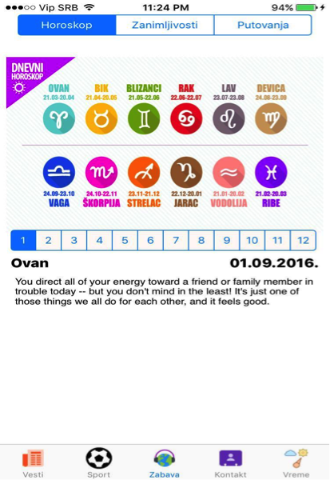
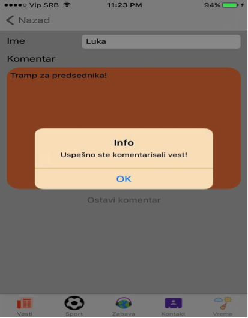

# IoSApp
Potrebno je napraviti IoS mobilnu aplikaciju čija će primarna namena biti isčitavanje vesti. Zbog prirode zahteva, neophodno je napraviti 2 baze, jedna na serveru, sa koje će mobilni uređaji kupiti podatke, druga na samom uređaju. Razlog pravljenja druge jeste  - ukoliko nestane internet konekcije da korisnik ima pristup određenom broju vesti. Lokalna baza će biti napunjena prilikom pokretanja aplikacije kada ona bude imala internet konekciju. 
	Pored samog učitavanja vesti, postojaće mogućnost davanja komentara na određenu vest, kao i ocenjivanje komentara (lajk/dislajk). Ocena komentara sa jednog uređaja se ne može dva puta dati na istu vest. Svaki komentar imaće određeni broj lajkova/dislajkova. 
	Aplikacija koristi nekoliko web servisa. Prvi web servis jeste upravo napravljen za korišćenje ove konkretno aplikacije. 
 
Primer get zahteva : http://multiplaskleroza.org.rs/selectMobRacunarstvo.php?tabela=Vest&id=sport&limit=3  
Pored  ovog get dela, servis ima dve post.php skripte koje kada se pozivaju, kada se ubaci novi komentar/kada se da ocena na neki komentar (insert/ update). Što se javnih servisa tiče, neki od korišćenih aplikacija jesu Facebook Api, Twitter Api, Open Weather Map Api, Google Maps Api, Horoskop Api. Neke od korišćenih biblioteka su : Sqlite, SwiftyJson.  
Osim dela za vesti, korisnik ima uvid u dnevni horoskop, ima uvid u trenutnu prognozu. Takođe može videti svoju lokaciju na mapi, kako da dođe do konkretne lokacije koja je postavljena kao središte naše institucije. Može postaviti Facebook status, tvit, pozvati nas, poslati nam poruku i poslati mejl (sve u okviru aplikacije). 

NAPOMENA : Aplikacija je napravljena i u Swift i u Objective C programskom jeziku

<h3>Screenshotovi aplikacije: </h3>

&nbsp;&nbsp; 
&nbsp;&nbsp; 
&nbsp;&nbsp; 
&nbsp;
