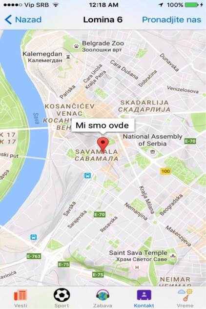
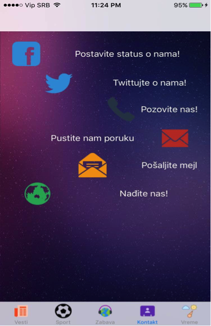
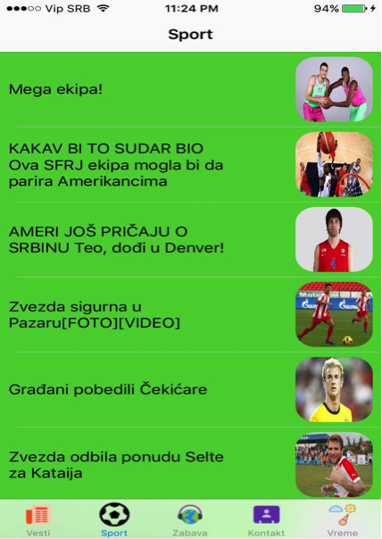

# IoSApp
Application description: Primary purpose of the app will be displaying news. 
Because of the nature of the problem, it is necessary to make 2 databases - one on the server/second one on the phone, where device will get information from server/local database. Why making the second one? If in the moment there is not internet connection, application would need to list some of the previosly loaded news. Local database will be filled with the data whenever the user enters the app while having access to the Internet. (It will be small ammount of the news picked up from the server, just recent ones) 

As a news portal, it has possibility giving a comment about certain news, as well a rating comments (like/dislike). Single device can only give single like/dislike for particular comment. Application uses several web services. Because of the nature, one has been made particulary for taking out news from database and inserting comments/likes or dislikes (PHP scripts) which are GET, POST requests(select, insert and update operations) 

 Example : http://multiplaskleroza.org.rs/selectMobRacunarstvo.php?tabela=Vest&id=sport&limit=3 

For the purpose of manipulating the data Sqlite and SwiftyJSON libraries were used.

Also, several public web services were used, such as Open Weather API, Google Maps API, Facebook API, Twitter API, Horoscope API.

User has access to daily horoscope, current temperature. It can see his current location on map, and also how to come to concrete location which is put on the map randomly(Has no meaning, used as parameter for the institution location). 

And lastly, there is possibility to post a Facebook status, Tweet, contact the institution by : call, message.
Language used for this application: Swift

<h3>Some of the screenshots: </h3>

&nbsp;&nbsp; 
&nbsp;&nbsp; 
&nbsp;&nbsp; 
&nbsp;
